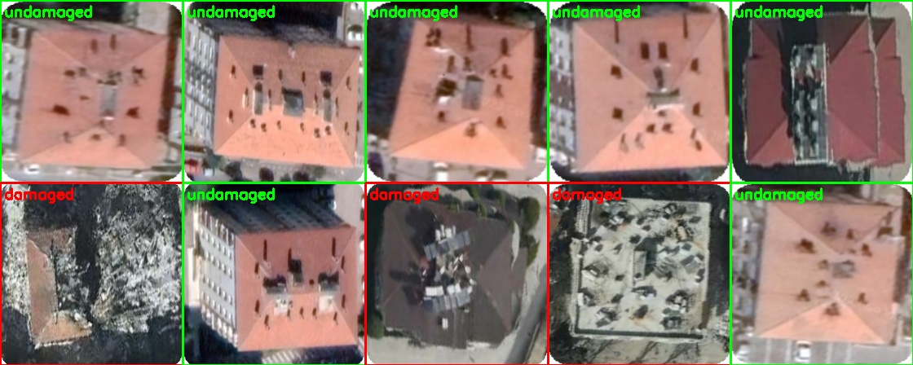
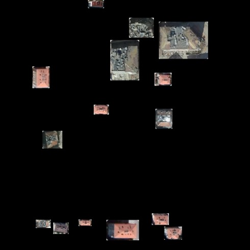
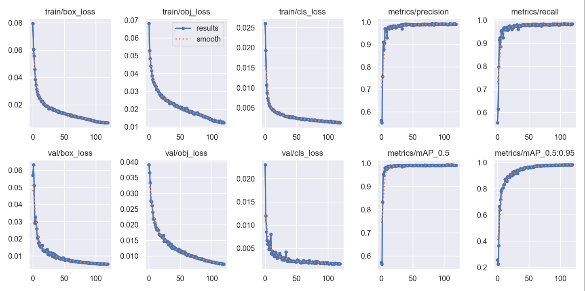
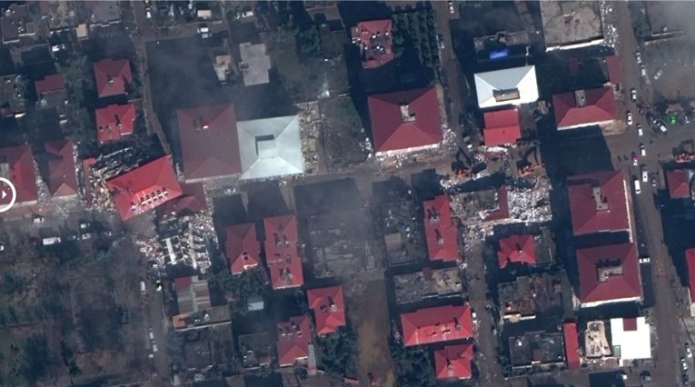
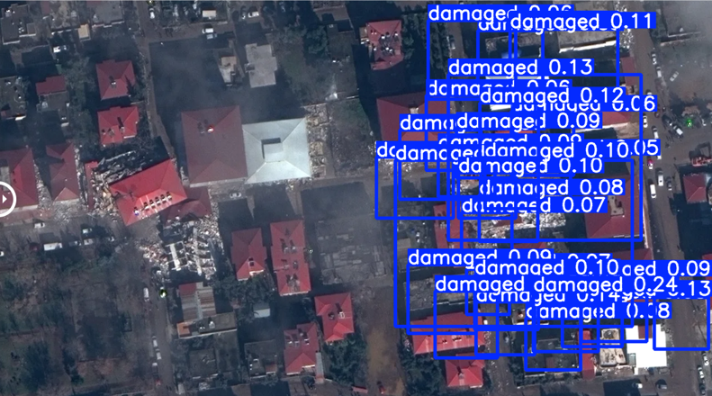

## **Building Damage Assessment AI**

#  *Project Overview*
Author: Demir Bucukoglu (Cohort: James Tribble)
Objective: Automate post-earthquake building damage assessment using aerial imagery.
Stages:

Stage 1: Image classification with ResNet-50 to label individual buildings as damaged or undamaged.

Stage 2: Object detection with YOLOv5 to locate multiple buildings within large scenes and classify their damage status.

Use Case: Accelerate disaster response by pinpointing hard-hit areas from satellite/drone imagery.

# *Methodology*
Stage 1: Image Classification (ResNet-50)
The project began by fine-tuning a pre-trained ResNet-50 CNN on a dataset of ~2,600 labeled building images (1,237 damaged, 1,498 undamaged) sourced from the Turkey Earthquake 2023 Kaggle dataset. Transfer learning allowed the model to achieve high accuracy quickly, confirming that damage can be recognized when images are cropped to single buildings. However, classification alone does not generalize to large scenes containing multiple structures.

Stage 2: Object Detection with YOLOv5
To detect and classify multiple buildings within aerial scenes, we adopted YOLOv5 for its speed and accuracy.

Patchwork 1.0 (Synthetic Data Generation)
“Combined ten random building images to create a synthetic satellite image

    <em>Figure 1: Example synthetic training image from Patchwork 1.0.</em> 

Limited diversity (only ~10 unique crops) led to overfitting and poor generalization.

Patchwork 2.0 (Improved Augmentation)
Pasted building crops (damaged and undamaged) at random positions, scales, and rotations onto a plain black background.

    <em>Figure 1: Example synthetic training image from Patchwork 2.0.</em> 

Generated ~2,500 synthetic images with corresponding YOLO-format annotations.

Re-trained YOLOv5 on this dataset, resulting in substantially improved detection and classification performance on real aerial imagery.

# *Pipeline Summary*
Detection: Run YOLOv5 on large images to locate buildings.

Classification: Label each bounding box as “damaged” or “undamaged.”

This end-to-end pipeline achieves automated building damage assessment in complex scenes.

# *Results*

    <em>Figure 2: YOLOv5 training/validation metrics over 100 epochs (losses and mAP curves).</em> 
 
    <em>Figure 3: Actual image from an earthquake in Turkiye.</em> 
 
    <em>Figure 4: Distinguishing damaged (blue) structures.</em> 
 

# *Challenges and Learnings* 
Data Scarcity: Only one freely available dataset necessitated synthetic augmentation.

Overfitting: Patchwork 1.0 highlighted the need for varied training samples.

Compute Time: Training on an RTX 2070 took ~5 hours, underscoring efficient experimentation.

Skill Growth: Gained hands-on experience in transfer learning, data annotation, and state-of-the-art object detection.

Conclusion
This project demonstrates how synthetic data generation and modern CNN architectures can overcome data limitations in disaster response. By evolving from classification to detection, the system now automatically identifies and classifies building damage in overhead imagery—providing a valuable tool for rapid post-earthquake assessment.
